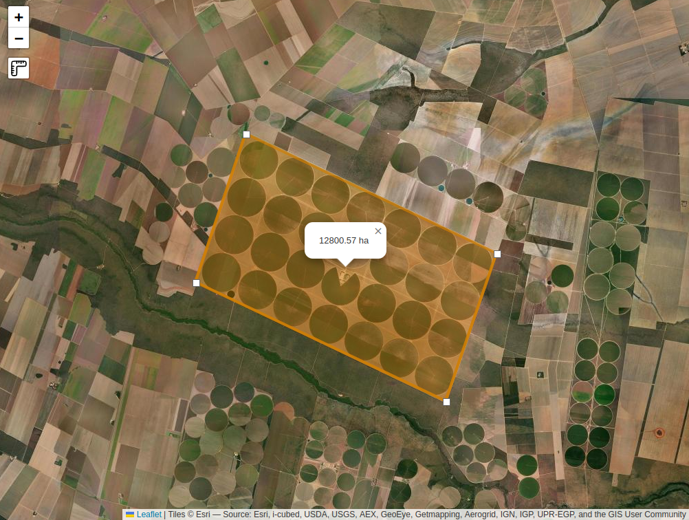

# Leaflet.AreaRuler

A simple tool to measure area on map.

Requires [Leaflet](https://github.com/Leaflet/Leaflet/releases) 1.0.0+ branches

Requires [Leaflet.Draw](https://github.com/leaflet/Leaflet.Draw#readme)

## Install

```shell
npm install leaflet-arearuler
```

## Demo

Check out the [demo](https://gabriel-russo.github.io/Leaflet.AreaRuler/example/)



## Usage

As map option:

```js
const map = L.map('map', { areaRulerControl: true });
```

Or like any control:

```js
const options = {}; // See docs to see options
L.Control.arearuler(options)
  .addTo(map);
```

## Docs

### Options:

```js
// Default plugin options object, change wathever you want
options = {
  position: 'topleft',
  unity: 'ha', // m, ha, alq, km
  shapeOptions: {
    color: "#d07f03",
    stroke: true,
    weight: 4,
    opacity: 0.7,
    fill: true,
  },
  icon: new L.DivIcon({
    iconSize: new L.Point(9, 9),
    className: 'leaflet-div-icon leaflet-editing-icon',
  }),
  text: {
    title: 'Measure area',
  },
};
```

### Methods

| Method Name | Description                                       |
|-------------|---------------------------------------------------|
| enabled     | Gets a true/false of whether the ruler is enabled |
| setOptions  | Update options after instantiate                  |
| toggle      | Toggles the ruler on or off                       |

### Events:

* `arearuler:measurestart` - Event fired when the measure handler are added to map
* `arearuler:newarea` - Event fired when a new segment/vertex is added
  ```js
  // Event data example: unity = ha
  {
    converted: {
      area: 11.48,
      unity: "ha"
    },
    original: {
      area: 114848.85315528093,
      unity: "m"
    },
    type: "arearuler:newarea",
  // target ...,
  // sourceTarget...,
  }
  ```
* `arearuler:newmeasure` - Event fired when the user starts a new measure
* `arearuler:measurestop` - Event fired when the measure handler are removed from map

### Custom html button

If you are developing a web application and you want to use your own html button outside the map container, you can use
the following code:

```javascript
const options = {
  button: document.getElementById('my-button'), // Your html button HTML reference
}

const control = L.Control.arearuler(options)
  .addTo(map);
```

After that, you have to make your own segments output box using the events described above.

You can see the example [here](https://gabriel-russo.github.io/Leaflet.AreaRuler/example/with-button.html)

## Development

```shell
npm install --save-dev     # install dependencies
npm run dev  # Compile and save at dist/ after any change
```

Open `index.html` in your browser and start editing.

## Authors

* Gabriel Russo
